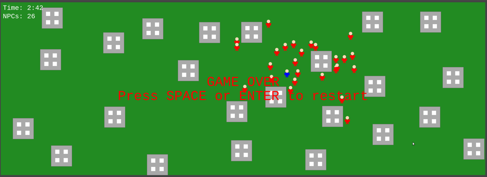

# Zombie Survival web/js game

Welcome to **Top View Game**, a 2D top-down game built using Phaser 3. In this game, you control a player character navigating through a map populated with buildings and pursuing NPCs (Non-Player Characters). The NPCs use predictive AI to chase the player, making the gameplay challenging and engaging.

See LIVE here [Zombie Survival Game](https://www.michal-drozd.com/zombie-web-game/)



## Features

- **Player Character**: Move the player using keyboard controls with smooth animations.
- **NPCs with Predictive AI**: NPCs chase the player by predicting their future position based on current velocity.
- **Buildings as Obstacles**: Randomly generated buildings that the player and NPCs must navigate around.
- **Dynamic NPC Spawn Rate**: NPCs spawn at increasing rates over time, escalating the game's difficulty.
- **Borders**: Invisible walls around the map prevent the player and NPCs from moving off-screen.
- **HUD Display**: On-screen timer and NPC count display essential gameplay information.
- **Game Over and Restart**: Upon collision with an NPC, the game pauses and can be restarted.

## Getting Started

### Prerequisites

- **Node.js and npm**: Ensure you have [Node.js](https://nodejs.org/en/download/) installed (which includes npm).
- **A Web Server**: The game requires a local web server to run correctly due to browser security policies.

### Installation

1. **Clone the Repository**

   ```bash
   git clone https://github.com/michaldrozd/zombie-web-game.git
   cd zombie-web-game
